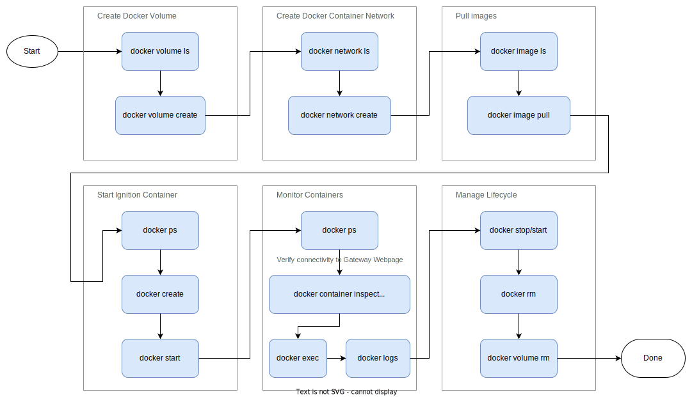

# Part One - Docker CLI Introduction

In part one, we'll explore the Docker CLI and run through the steps to start a single container.  Through this, you'll gain a general understanding on how to view various resources (containers, volumes, networks, etc) and how to manage them.



## General

```bash
# Run `docker` with no arguments for help
docker
```

```bash
# Run `docker COMMAND --help` for help on a given command
docker container --help
docker network --help
```

```bash
# Run `docker COMMAND SUBCOMMAND --help` for further help
docker container run --help
docker volume ls --help
```

## Named Volumes

```bash
# List volumes
docker volume ls
```

```bash
# Create a volume called `ignition-data` for our gateway
docker volume create ignition-data
```

## Docker Networks

```bash
# List current Docker networks
docker network ls
```

```bash
# Create a dedicated bridge network for our container[s]
docker network create ignition-net
```

## Docker Images

```bash
# List installed images
docker image ls
```

```bash
# Pull `inductiveautomation/ignition` image with `8.1.19` tag from Docker Hub
docker pull inductiveautomation/ignition:8.1.19
```

## Docker Containers

```bash
# List running containers
# NOTE: the implicit command for `docker` is `container`,
#       so `docker ps` is equivalent shorthand.
docker container ps
```

```bash
# List all containers (including stopped)
docker container ps -a
```

## Start an Ignition Container

```bash
# Create an Ignition container
# NOTE: We use backslashes on Unix-like systems to escape the
#       newlines.  You'd use backticks on Powershell (Windows).
docker container create \
  -p 9088:8088 \
  -e IGNITION_EDITION=standard \
  -v ignition-data:/usr/local/bin/ignition/data \
  --network ignition-net \
  --name ignition-pt1 \
  inductiveautomation/ignition:8.1.19 \
  -n Ignition-part-one \
  -m 1024
```

```bash
# List all non-running containers
docker container ps -a
```

```bash
# Start the container
docker container start ignition-pt1
```

## Monitoring containers

```bash
# List running containers
docker container ps
```

```bash
# Inspect configuration JSON of container
docker container inspect ignition-pt1
```

```bash
# View the logs of the container
docker logs ignition-pt1
```

```bash
# Follow the logs of the container starting with the last 10 lines
docker logs --tail=10 -f ignition-pt1
```

```bash
# Open a `bash` shell within the container (ctrl-d to logout when done, or type `exit`)
docker exec -it ignition-pt1 bash
```

## Manage lifecycle of containers

```bash
# Stop Ignition container
docker stop ignition-pt1
```

```bash
# Restart (or start when stopped) Ignition container
docker restart ignition-pt1
```

```bash
# Remove the Ignition container (only valid when stopped)
docker rm ignition-pt1
```

```bash
# Remove the Ignition named volume (only valid when container is removed)
docker volume rm ignition-data
```

```bash
# Remove the Ignition bridge network (only valid when no running containers are attached)
docker network rm ignition-net
```

## Additional Tips

```bash
# Use `docker run` to combine Create+Start
# NOTE: this will also automatically create the named
#       volume `ignition-data` if not present.
docker run \
  -d \
  -p 9088:8088 \
  -e IGNITION_EDITION=standard \
  -v ignition-data:/usr/local/bin/ignition/data \
  --network ignition-net \
  --name ignition-pt1 \
  inductiveautomation/ignition:8.1.19 \
  -n Ignition-part-one \
  -m 1024
```

```bash
# Chain commands together with `&&` (works with PowerShell, too)
docker stop ignition-pt1 && docker rm ignition-pt1
```

```bash
# Use tools like `jq` with JSON output for colorizing and additional filtering/querying
# ref: https://stedolan.github.io/jq/
docker inspect ignition-pt1 | jq
```